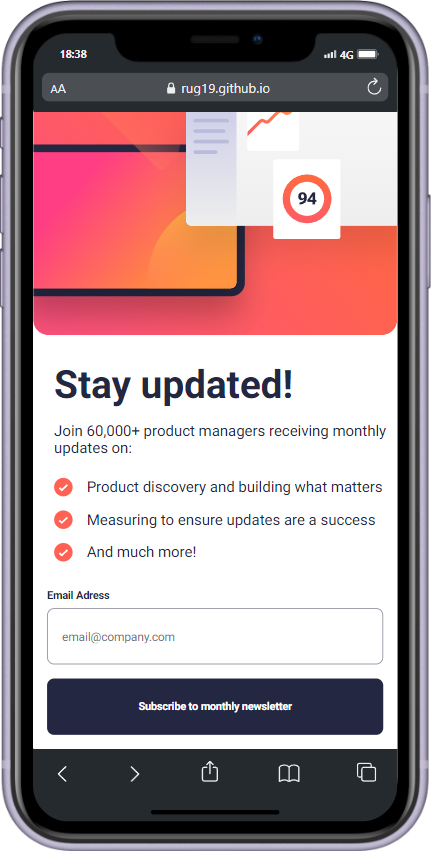

# Newsletter sign-up form with success message solution 
I started to learn JavaScript recently. I've created a project to master JavaScript-based email validation techniques. It was a challenge, but I decided to include React.js. I want to learn about components and how the JSX file works.
## Table of contents

- [Overview](#overview)
  - [The challenge](#the-challenge)
  - [Screenshot](#screenshot)
  - [Links](#links)
- [My process](#my-process)
  - [Built with](#built-with)
  - [What I learned](#what-i-learned)
  - [Continued development](#continued-development)
  - [Useful resources](#useful-resources)
- [Author](#author)
- [Acknowledgments](#acknowledgments)

## Overview

### The challenge

Users should be able to:

- Add their email and submit the form
- See a success message with their email after successfully submitting the form
- See form validation messages if:
  - The field is left empty
  - The email address is not formatted correctly
- View the optimal layout for the interface depending on their device's screen size
- See hover and focus states for all interactive elements on the page

### Screenshot

Desktop version


Mobile version



### Links

- Solution URL: https://github.com/rug19/newsletter-sign-up-with-success-message-main.git
- Live Site URL: https://rug19.github.io/newsletter-sign-up-with-success-message-main/

## My process

### Built with

- Semantic HTML5 markup
- CSS custom properties
- Flexbox
- [React](https://reactjs.org/) - JS library

### What I learned

This is the first project I did in React, so it was a little complicated for me to understand some concepts. So, I had to research a lot of things; one of those I found was about GitHub Pages. This platform lets you host static websites from your repository right away. You can use JavaScript libraries or frameworks. These include React, Angular, jQuery, and d3.js. You can also use CSS libraries such as Bootstrap, Tailwind, Bulma, and so on. Be careful, this platform is for static sites; he's not able to handle the back end.

#### Step 1: Install the gh-pages Package

- In the terminal, navigate to your project's direcotry.
- Run the following command to install `gh-pages` as development dependency:
  
```
npm install gh-pages --save-dev
```

#### Step 2: Configure the Deployment Script
- Open your project's `package.json` file.
- Add a deploy script that uses the `gh-pages` command to publish the `dist` folder.

```
"scripts": {
  "predeploy": "npm run build",
  "deploy": "gh-pages -d build"
}
```
#### Step 4: Set Up the Repository

- Create a new repository on Github if you haven`t already.
- Initialize a local Git repository and connect it to your GitHub repository:
  
```
git init
git remote add origin https://github.com/<username>/<repository-name>.git

}
```
#### Deploy the Projetc

- Run the following command in your terminal to build and publish the `dist` or `build` folder:

````
npm run deploy
````

#### Complete example 

For a React project like this one, your `package.json` might look like this: 

````
{
  "name": "my-project",
  "version": "1.0.0",
  "private": true,
  "dependencies": {
    "react": "^17.0.2",
    "react-dom": "^17.0.2",
    "react-scripts": "4.0.3"
  },
  "scripts": {
    "start": "react-scripts start",
    "build": "react-scripts build",
    "test": "react-scripts test",
    "eject": "react-scripts eject",
    "predeploy": "npm run build",
    "deploy": "gh-pages -d build"
  },
  "devDependencies": {
    "gh-pages": "^3.2.3"
  }
}

````


If you want more help with writing markdown, we'd recommend checking out [The Markdown Guide](https://www.markdownguide.org/) to learn more.

**Note: Delete this note and the content within this section and replace with your own learnings.**

### Continued development

Use this section to outline areas that you want to continue focusing on in future projects. These could be concepts you're still not completely comfortable with or techniques you found useful that you want to refine and perfect.

**Note: Delete this note and the content within this section and replace with your own plans for continued development.**

### Useful resources

- [Example resource 1](https://www.example.com) - This helped me for XYZ reason. I really liked this pattern and will use it going forward.
- [Example resource 2](https://www.example.com) - This is an amazing article which helped me finally understand XYZ. I'd recommend it to anyone still learning this concept.

**Note: Delete this note and replace the list above with resources that helped you during the challenge. These could come in handy for anyone viewing your solution or for yourself when you look back on this project in the future.**

## Author

- Website - [Add your name here](https://www.your-site.com)
- Frontend Mentor - [@yourusername](https://www.frontendmentor.io/profile/yourusername)
- Twitter - [@yourusername](https://www.twitter.com/yourusername)

**Note: Delete this note and add/remove/edit lines above based on what links you'd like to share.**

## Acknowledgments

This is where you can give a hat tip to anyone who helped you out on this project. Perhaps you worked in a team or got some inspiration from someone else's solution. This is the perfect place to give them some credit.

**Note: Delete this note and edit this section's content as necessary. If you completed this challenge by yourself, feel free to delete this section entirely.**
